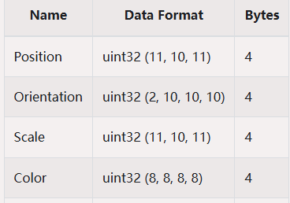
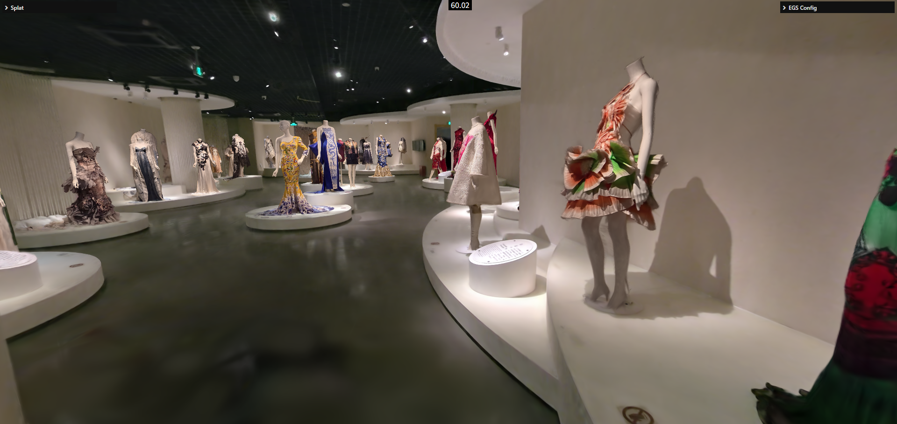
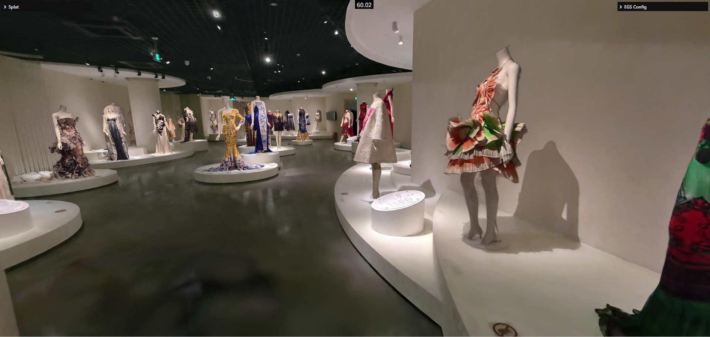
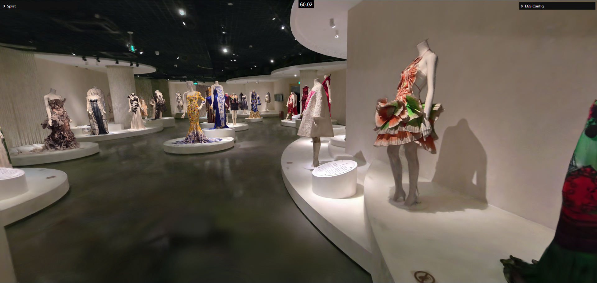
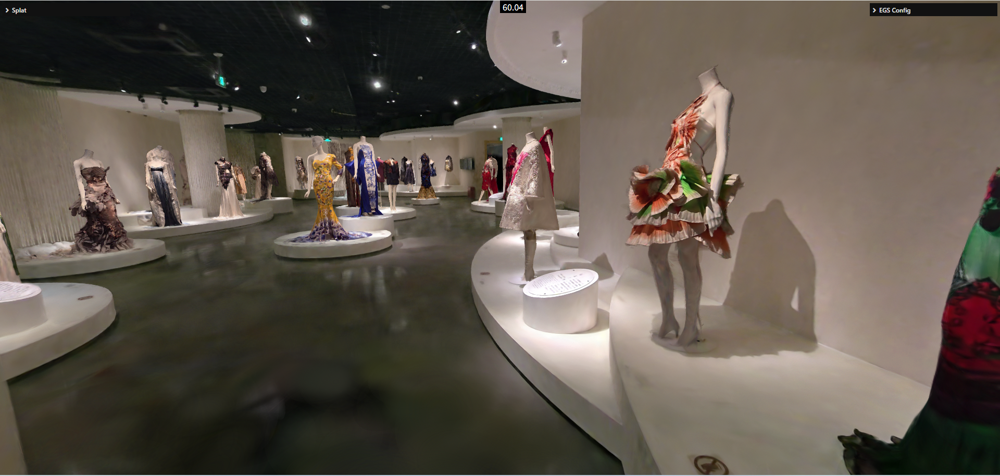
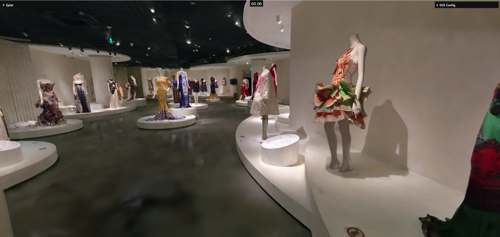
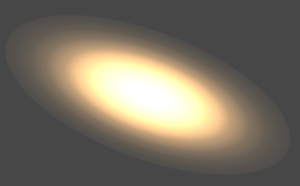
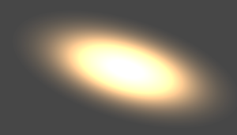

## Background

No single configuration covers every 3DGS scene. Scenes differ in data precision, size, GPU memory usage, device performance, and image quality requirements, so choose a configuration set that matches the target scenario.

This page summarizes common data formats, `packType` differences, preset options, and the parameters you can tune after choosing a preset.

## Quick Choice

Choose the preset according to scene constraints first, then tune only the most important parameters. Avoid changing precision, sorting, and blur parameters at the same time at the start.

| Target Scenario                                           | Recommended Preset    | Key Settings                                                              |
| --------------------------------------------------------- | --------------------- | ------------------------------------------------------------------------- |
| Image quality first, with strong user hardware            | Max Quality           | `packType`, `packHighPrecisionEnabled`, `highPrecisionAttachEnabled`      |
| Large scenes that can fail under low precision            | Quality First         | `compressed`, high-precision merge, `maxStdDev`                           |
| Weaker devices that still need a mostly complete image    | Performance First     | `super-compressed`, `detailCullingThreshold`, `maxPixelRadius`            |
| Very large scenes or very low-end devices                 | Extreme Performance 0 | `repackEnabled`, `sortMinDuration`, more aggressive precision compression |
| Source data is sog and the target is larger scene loading | Extreme Performance 1 | `sog`, `precalculateEnabled`, GPU memory usage                            |

## 3DGS File Formats

| Format                      | Size                      | Render Quality               | Implementation Notes                                                                                                                                                                                                                                |
| --------------------------- | ------------------------- | ---------------------------- | --------------------------------------------------------------------------------------------------------------------------------------------------------------------------------------------------------------------------------------------------- |
| `ply`                       | 100%                      | Good                         | High original precision and the largest file size.                                                                                                                                                                                                  |
| `supersplat compressed ply` | 30%, about 17% after gzip | Good                         | Uses 256 splats per chunk and is likely spatially partitioned similarly to ksplat. `center`, `quat`, `scale`, and `rgb` are compressed by min/max, rescale, and quantization. SH can be compressed to u8; observed data is about 5 bit.             |
| `spz`                       | 10%                       | Average                      | Retains relatively high precision for core splat data, especially `center`, so sharpness loss is lower. SH precision is very low and can cause visible color shifts in fine-detail scenes.                                                          |
| `splat`                     | 14%                       | Average, not universal       | Drops `shN` during compression. Layout: `center.xyz (f32)`, `scale.xyz (f32)`, `color.rgba (u8)`, `quat (u8)`, 32 bytes in total.                                                                                                                   |
| `ksplat`                    | 20%-30%                   | Depends on compression level | Level 0 is uncompressed, level 1 is 16 bit, and level 2 is 8 bit. It spatially clusters splats for local coordinate compression, following a similar approach to compressed ply.                                                                    |
| `sog`                       | 5%                        | Average                      | Applies PLAS sorting to `center`, `scales`, `quats`, and `sh0(rgba)`, then computes min/max values and quantizes the data. `shN` uses k-means clustering with centroids and labels to restore data while reducing size. Images tend to be blurrier. |



## packType

`packType` controls the data precision generated when parsing splats. Different settings trade off size, quality, and performance.

### Compressed

| Field           | Precision    |
| --------------- | ------------ |
| `position`      | `f32 (3)`    |
| `scale`         | `f16 (3)`    |
| `quat`          | `f16 (4)`    |
| `color & alpha` | `f16 (4)`    |
| `shN`           | `s_11_10_11` |

`Compressed` favors image quality and data precision. Use it for quality-sensitive output, large scenes, or scenes that show artifacts at lower precision.

### SuperCompressed

| Field           | Precision                              |
| --------------- | -------------------------------------- |
| `position`      | `f16 (3)`                              |
| `scale`         | `u8 (3)`                               |
| `quat`          | `u8 (4)`                               |
| `color & alpha` | `u8 (4)`                               |
| `shN`           | `sh1 (sint5)`, `sh2` and `sh3 (sint4)` |

`SuperCompressed` favors file size, memory, and GPU memory control. Use it when resources are constrained, devices are lower-end, or performance is the priority.

### Sog

`Sog` is for sog data. It has the smallest size, but the image can look blurrier. Prefer it when the source format is sog and the data has no `shN`, or when extreme scene scale is required.

## Preset List

| Preset                | Recommended Scenario                                                                                                                                                     |
| --------------------- | ------------------------------------------------------------------------------------------------------------------------------------------------------------------------ |
| Max Quality           | Use when visual quality is the highest priority and user hardware is strong.                                                                                             |
| Quality First         | Use for large scenes, such as cities, that can render incorrectly at low precision. This preset still assumes a reasonable level of device performance.                  |
| Performance First     | Use on lower-end machines.                                                                                                                                               |
| Extreme Performance 0 | Use on very low-end machines or for extremely large scenes.                                                                                                              |
| Extreme Performance 1 | Use on very low-end machines or for extremely large scenes when the source data is sog. Prefer this preset when the condition is met, because it can load larger scenes. |

### Max Quality

```typescript
// set parser config
const splatData = await SplatLoader.parseSplatData(
    // file type and data
    splatFileType,
    content,
    // compress config & sh
    SplatLoader.SplatPackType.Compressed,
    {
        maxShDegree: 3,
    },
);
const splat = await SplatUtils.createSplat(splatData);
viewer.getScene().add(splat);

// update viewer config
setViewerConfig(viewer, {
    pipeline: {
        Splatting: {
            packHighPrecisionEnabled: true,
            precalculateEnabled: true,
            repackEnabled: false,
            normalizedFalloff: true,
            preBlurAmount: 0.3,
            blurAmount: 0,
            focalAdjustment: 2,
            detailCullingThreshold: 0,
            maxPixelRadius: 1024,
            maxStdDev: Math.sqrt(8),
            composite: {
                enabled: true,
                highPrecisionAttachEnabled: true,
            },
        },
    },
});
```



### Quality First

```typescript
// set parser config
const splatData = await SplatLoader.parseSplatData(
    // file type and data
    splatFileType,
    content,
    // compress config & sh
    SplatLoader.SplatPackType.Compressed,
    {
        maxShDegree: 3,
    },
);
const splat = await SplatUtils.createSplat(splatData);
viewer.getScene().add(splat);

// update viewer config
setViewerConfig(viewer, {
    pipeline: {
        Splatting: {
            packHighPrecisionEnabled: true,
            precalculateEnabled: true,
            repackEnabled: false,
            normalizedFalloff: false,
            preBlurAmount: 0.3,
            blurAmount: 0,
            focalAdjustment: 2,
            detailCullingThreshold: 1,
            maxPixelRadius: 1024,
            maxStdDev: Math.sqrt(8),
            composite: {
                enabled: false,
                highPrecisionAttachEnabled: false,
            },
        },
    },
});
```



### Performance First

```typescript
// set parser config
const splatData = await SplatLoader.parseSplatData(
    // file type and data
    splatFileType,
    content,
    // compress config & sh
    SplatLoader.SplatPackType.SuperCompressed,
    {
        maxShDegree: 3,
    },
);
const splat = await SplatUtils.createSplat(splatData);
viewer.getScene().add(splat);

// update viewer config
setViewerConfig(viewer, {
    pipeline: {
        Splatting: {
            packHighPrecisionEnabled: false,
            precalculateEnabled: true,
            repackEnabled: false,
            normalizedFalloff: false,
            preBlurAmount: 0.3,
            blurAmount: 0,
            focalAdjustment: 2,
            detailCullingThreshold: 1,
            maxPixelRadius: 1024,
            maxStdDev: Math.sqrt(5),
            composite: {
                enabled: false,
                highPrecisionAttachEnabled: false,
            },
        },
    },
});
```



### Extreme Performance 0

```typescript
// set parser config
const splatData = await SplatLoader.parseSplatData(
    // file type and data
    splatFileType,
    content,
    // compress config & sh
    SplatLoader.SplatPackType.SuperCompressed,
    {
        maxShDegree: 3,
    },
);
const splat = await SplatUtils.createSplat(splatData);
viewer.getScene().add(splat);

// update viewer config
setViewerConfig(viewer, {
    pipeline: {
        Splatting: {
            packHighPrecisionEnabled: false,
            precalculateEnabled: true,
            repackEnabled: true,
            normalizedFalloff: false,
            preBlurAmount: 0.3,
            blurAmount: 0,
            focalAdjustment: 2,
            detailCullingThreshold: 4,
            maxPixelRadius: 1024,
            maxStdDev: Math.sqrt(5),
            composite: {
                enabled: false,
                highPrecisionAttachEnabled: false,
            },
            sort: {
                sortRadial: true,
                sortMinDuration: 160,
                sortSplatDistance: 0.1,
                sortSplatCoorient: 0.999999,
                sortCameraDistance: 1,
                sortCameraCoorient: 0.99,
            },
        },
    },
});
```



### Extreme Performance 1

```typescript
// set parser config
const splatData = await SplatLoader.parseSplatData(
    // file type and data
    SplatFileType.SOG,
    content,
    // compress config & sh
    SplatLoader.SplatPackType.Sog,
    {
        maxShDegree: 0,
    },
);
const splat = await SplatUtils.createSplat(splatData);
viewer.getScene().add(splat);

// update viewer config
setViewerConfig(viewer, {
    pipeline: {
        Splatting: {
            packHighPrecisionEnabled: false,
            precalculateEnabled: false,
            repackEnabled: true,
            normalizedFalloff: false,
            preBlurAmount: 0.3,
            blurAmount: 0,
            focalAdjustment: 2,
            detailCullingThreshold: 4,
            maxPixelRadius: 1024,
            maxStdDev: Math.sqrt(5),
            composite: {
                enabled: false,
                highPrecisionAttachEnabled: false,
            },
            sort: {
                sortRadial: true,
                sortMinDuration: 160,
                sortSplatDistance: 0.1,
                sortSplatCoorient: 0.999999,
                sortCameraDistance: 1,
                sortCameraCoorient: 0.99,
            },
        },
    },
});
```



## Custom Configuration

Presets cannot cover every scene. In real integrations, choose the closest preset as the starting point, then tune a small number of key parameters.
Parameters can be adjusted through the [config](../config/) API:

```typescript
setViewerConfig(viewer, {
    pipeline: {
        Splatting: {
            // ... options..
        },
    },
});
```

| Parameter                              | Purpose                                                 | Recommendation                                                                                                                                                     |
| -------------------------------------- | ------------------------------------------------------- | ------------------------------------------------------------------------------------------------------------------------------------------------------------------ |
| `packHighPrecisionEnabled`             | Enables high-precision data merging.                    | Determines the final data precision used for rendering. Usually enable it for `compressed`; evaluate it per scene for `sog`.                                       |
| `precalculateEnabled`                  | Enables spherical-harmonic calculation.                 | Enable it when the data has no `shN` to save performance and GPU memory.                                                                                           |
| `repackEnabled`                        | Enables repack behavior.                                | A performance optimization for large scenes, usually used with `sortMinDuration`. It can often improve performance by 50%-100%, but increases GPU memory usage.    |
| `composite.highPrecisionAttachEnabled` | Enables a high-precision render attachment.             | Consider enabling it when the scene shows ripple-like banding artifacts, or when quality is important. It increases GPU memory usage.                              |
| `normalizedFalloff`                    | Enables normalized Gaussian falloff.                    | Most scenes show little difference. Do not enable it unless you need the best possible quality.                                                                    |
| `preBlurAmount` / `blurAmount`         | Controls blur parameters.                               | Non-AA training results usually use `0.3 / 0`; AA training results usually use `0 / 0.3`. Other values are not recommended.                                        |
| `focalAdjustment`                      | Adjusts splat spread scale.                             | `2` is closer to the reference result.                                                                                                                             |
| `detailCullingThreshold`               | Approximate detail culling.                             | Usually in `[0, 4]`. Setting it to `1` usually causes minimal visual loss; the performance gain depends on scene detail.                                           |
| `maxPixelRadius`                       | Maximum screen-space pixel range covered by a Gaussian. | Default is `1024`; the recommended range is `[128, 1024]`. Too small a value can make the scene look broken.                                                       |
| `maxStdDev`                            | Maximum standard deviation of Gaussian spread.          | Should be between `sqrt(5)` and `sqrt(9)`. Larger values cost more performance but improve quality; `sqrt(8)` is usually a practical quality/performance midpoint. |
| `sort.sortMinDuration`                 | Minimum interval between sorting operations.            | Usually used with `repackEnabled`. A common setting is `16 * n`, where `n` is no greater than `10`.                                                                |

### normalizedFalloff Comparison



