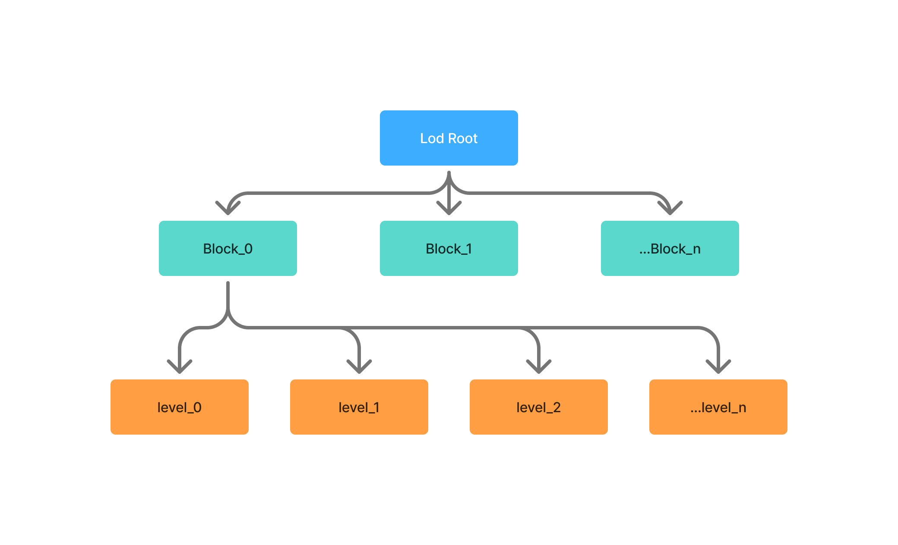

## 背景

`3DGS`目前在渲染大规模场景的情况下，需要的系统资源远超目前常规设备硬件规格，导致大规模`3DGS`基本不可能在常规设备上渲染，因此需要采用`stream+lod`的形式通过放弃不重要部分的细节提升视觉中心的质量以达到以较少系统资源需求展示大规模场景的目标。`@manycore/aholo-viewer`采用了分块+lod的`chunk-lod`的实现作为主要`lod`实现。`lod`生成采用了不需要依赖训练的后处理融合高斯的实现。



## `chunk-lod`生成

`@manycore/aholo-viewer`使用的`chunk-lod`数据主要可以通过[`@manycore/aholo-splat-transform`](./splat-transform.md)生成。我们`chunk-lod`生成主要经过以下几个步骤：

1. 块分割
    > 块分割主要采用八叉树进行分割，默认单块最大大小为`400000`高斯，对于大型方案可以增加到`800000`或者更多以控制最终产生的`chunk`数量
2. 高斯查找和融合
    > 在每个块内，每级别的`lod`使用上一级别的结果生成，每个级别通过循环查找和合并使其达到目标数量。
    >
    > 对于保留数量较少的级别，会进一步对高斯进行放大处理以减少级别保留数量过少导致的空洞。
    >
    > 我们在融合后还会进行进一步的`opacity`剔除，减少可见性较差的高斯。
    >
    > 同时当高斯数量少于一定数量时，我们会不再进行进一步的融合，虽然此时会导致输出数量略多于目标数量，但是整体偏差很小，但是能减少最终输出的块整体还是值得的。
    >
    > 为了防止无法正常产出结果，我们会设定每个级别的最大迭代次数，当触及最大迭代次数时，即使未达到目标数量，我们依旧会直接跳出。
3. 输出处理
    > 输出时，会针对低级别的数据进行整体打包，一般低级别数据为原始数据的`1%`，数据量很少，打包后也能减少没必要块。完整处理后我们会输出`lod-meta.json`作为`chunk-lod`的描述文件。

参考资料：- [gaussian-hierarchy](https://github.com/graphdeco-inria/gaussian-hierarchy/tree/main) - [NanoGS](https://github.com/saliteta/NanoGS)

## `lod-meta.json`格式说明

```typescript
interface IBox {
    min: [number, number, number];
    max: [number, number, number];
}

// typings for
interface LodMeta {
    magicCode: 2500660;
    type: 'lod-splat';
    version: string;
    counts: number;
    shDegree: number;
    levels: number;
    files: string[];
    forwardBox: IBox;
    permanentFiles: number[];
    tree: Array<{
        bound: IBox;
        lods: Array<{
            file: number;
            offset: number;
            count: number;
        }>;
    }>;
}
```

- `counts`: `level 0`总高斯数量
- `shDegree`: 球协阶数
- `forwardBox`: `level 0`所有高斯中约`80%`高斯球体所在的空间的包围盒。
- `files`: 文件列表
- `permanentFiles`: 需要内存/显存持久化的文件索引
- `tree`: `lod`的分块树
    - `tree[i].bound`: 分块的包围盒，此包围盒同样采用近似的分布计算，排除离群点
    - `tree[i].lods`: 分块的lod数据
        - `tree[i].lods[j].file`: 数据文件索引
        - `tree[i].lods[j].start`: 起始高斯偏移
        - `tree[i].lods[j].count`: 高斯数量

## `Lod`调度器

`@manycore/aholo-viewer`提供完整的`chunk-lod`调度器，接口参考[`LodSplat`](api:SplatUtils.LodSplat)，使用样例可以参考[Streaming-LOD](../examples/splatting-lod-stream/)
