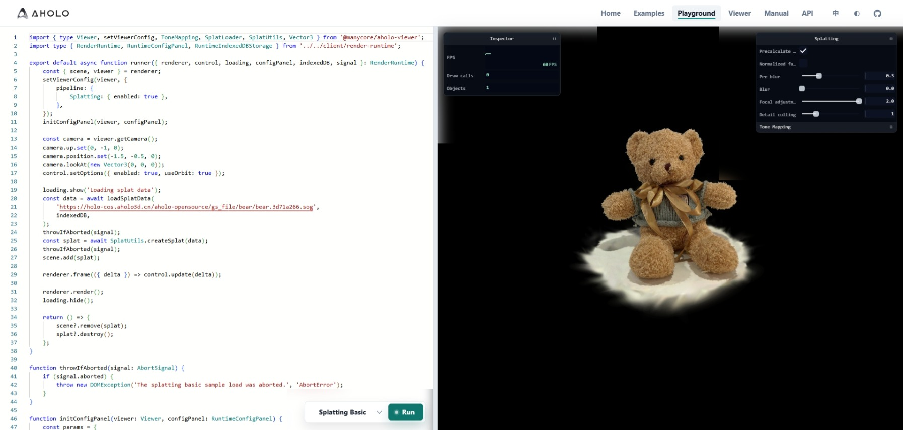

## 概览

[`Playground`](https://aholojs.dev/zh-CN/playground/)是一个方便用户直接使用`@manycore/aholo-viewer`进行代码验证的轻量在线编辑器。编辑器基于[`monaca-editor`](https://github.com/microsoft/monaco-editor)开发，并提供了完整的`typescript`支持和基础代码提示功能



## 使用方式

基础代码模板:

```typescript
import { type Viewer } from '@manycore/aholo-viewer';
import type { RenderRuntime } from '../../client/render-runtime';

// typing of `RenderRuntime`
// interface RenderRuntime {
//     // core renderer
//     renderer: RuntimeRenderer;
//     // camera interaction controller
//     control: CameraControl;
//     // loading fame controller
//     loading: RuntimeLoadingController;
//     // a config panel component base on tweakpane
//     configPanel: RuntimeConfigPanel;
//     // indexed db cache storage
//     indexedDB: RuntimeIndexedDBStorage;
//     // abort signal dispatcher
//     signal: AbortSignal;
// }

export default async function runner({ renderer, control, loading, configPanel, indexedDB, signal }: RenderRuntime) {
    const const { scene, viewer } = renderer;
    // do work with scene & viewer
    // ....
    // use `throwIfAborted(signal)` to check whether abort requested
    // use `loading.show(info)` to update the loading to what ever you want to indicate which step is running

    // config frame call back, return a boolean to indicate whether anything updated
    renderer.frame(({ delta }) => {
        const cameraUpdated = control.update(delta);
        let animationUpdated = false;
        // update animation here...
        return cameraUpdated || animationUpdated；
    });

    // request next frame render
    renderer.render();
    // hide loading frame
    loading.hide();
}

function throwIfAborted(signal: AbortSignal) {
    if (signal.aborted) {
        throw new DOMException('The splatting basic sample load was aborted.', 'AbortError');
    }
}
```

除了基础模板外，部分[示例](https://aholojs.dev/zh-CN/examples/splatting-basic/)也可以通过示例页面的下方按钮或者`playground`下方的预设选择直接打开现有的样例代码直接查看编辑。完成编辑后，点击**运行**执行代码即可看到展示效果。已经完成编辑的代码也可以通过直接复制链接分享给其他人。

## 注意事项

- 目前`playground`不支持导入第三方库。
- 如果需要反馈`@manycore/aholo-viewer`的相关问题，我们推荐在`playground`构造最小样例一并提交至[issues](https://github.com/manycoretech/aholo-viewer/issues)
