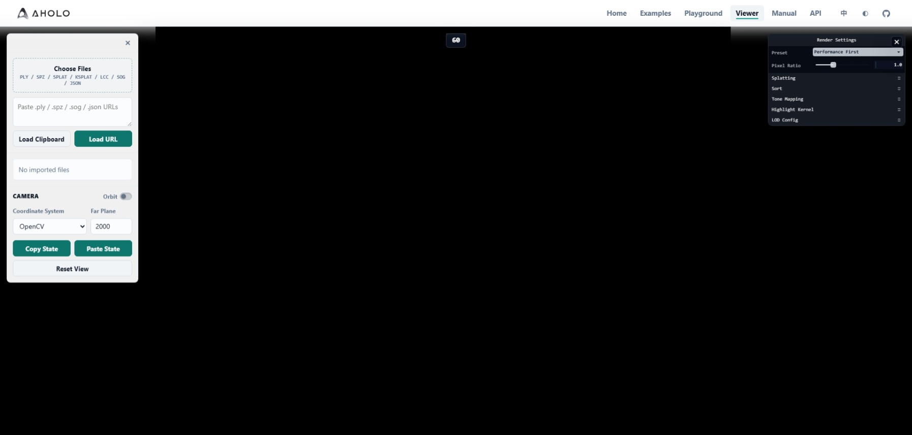

## Viewer

[Viewer](https://aholojs.dev/zh-CN/viewer/)是基于`@manycore/aholo-viewer`搭建的快速在线查看器，可以导入任意支持的资源直接查看展示效果，支持由[`@manycore/aholo-splat-transform`](./splat-transform.md)生成的lod格式数据

> 由于浏览器无法直接访问本地文件，对于`chunk-lod`的数据，需要使用服务器或者`CDN`承载。可以使用`@manycore/aholo-splat-dev-server`快速承载。



## 使用指南

- 左侧面板用于导入支持的格式数据和配置相机
    > 支持导入本地文件，url和剪贴板数据(url)，如果使用本地数据，仅支持完整的单个数据，不支持`chunk-lod`形式的数据。
    >
    > 相机提供可3种可切换的坐标系: OpenCV(-Y为上方向，点云坐标系)，OpenGL(+Y为上方向，常规模型坐标系)，Aholo(+Z为上方向，aholo平台数据默认坐标系)。
- 右侧面板用于控制`3DGS`相关功能和管线配置，可以参考[`3dgs-preset-config`](./3dgs-preset-config.md)

## 本地搭建快速验证平台

### 安装相关依赖

```bash
npm install @manycore/aholo-splat-transform -g
npm install @manycore/aholo-splat-dev-server -g
```

### 使用方式

`@manycore/aholo-splat-transform`完整使用指南可以参考[使用指南](./splat-transform.md)，此处不再赘述。

### `@manycore/aholo-splat-dev-server`

`@manycore/aholo-splat-dev-server`提供两个可执行命令，`splat-dev-server`是一个完整的本地快速承载服务，提供了快速承载相关资源，
`merge-lod`提供将多个`lod-meta.json`和相关资源合并成一个新的`lod-meta.json`，用于将分块处理的大型`3DGS`文件`chunk-lod`合并回一个。

- `splat-dev-server`: 用于启动快速承载`Viewer`使用的资源的服务器
    > ```bash
    > splat-dev-server [options] <dir>
    > Options:
    >    --help     Show help                                             [boolean]
    >    --version  Show version number                                   [boolean]
    > -a, --address  Address to listen               [string] [default: "127.0.0.1"]
    > -p, --port     Port to listen                         [number] [default: 3000]
    > ```
    >
    > 启动后可看到如下输出
    >
    > ```bash
    > ========================================
    > Splat dev server started
    > Host: 127.0.0.1:3000
    > Root: ./chunk-lod
    > Base URL: http://127.0.0.1:3000
    > ========================================
    > ```
    >
    > 通过`Base URL`访问`Root`下资源即可，可以直接填入`Viewer`对应的位置。
    >
    > **注意：当在`Viewer`种使用时浏览器可能弹出权限要求，请允许。`Viewer`不会访问未被承载的资源，也不会收集任何用户信息。**
- `merge-lod`: 用于把多个`chunk-lod`的生成结果合并为一个，通常用于分块生成`chunk-lod`后合并为一个完整的大型`chunk-lod`
    > ```bash
    > merge-lod -i <meta-files...> -o <output_dir>
    >
    > Options:
    >      --help     Show help                                             [boolean]
    >      --version  Show version number                                   [boolean]
    >  -i, --input    Input lod meta files(lod-meta.json)          [array] [required]
    >  -o, --output   Output directory                            [string] [required]
    > ```
