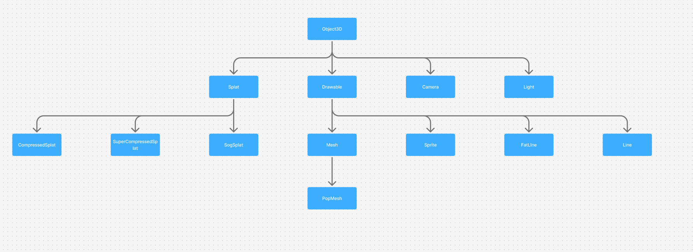
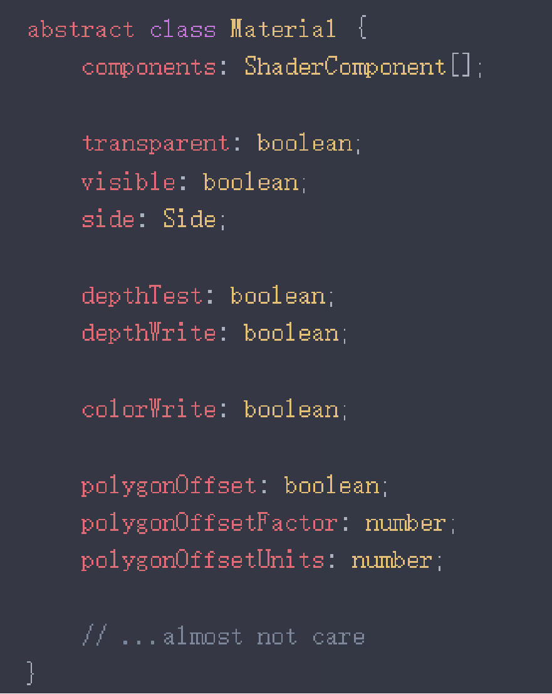
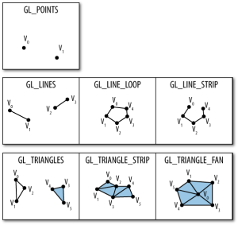
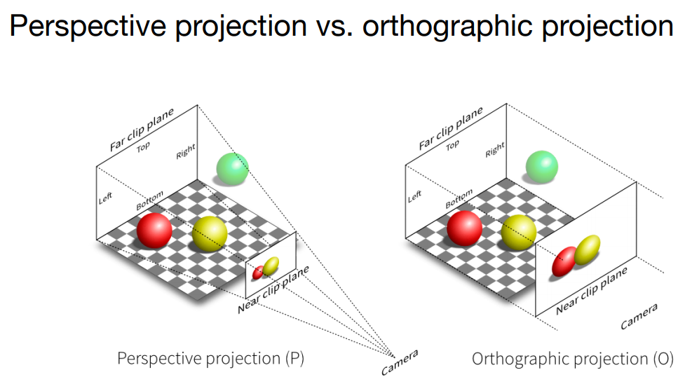
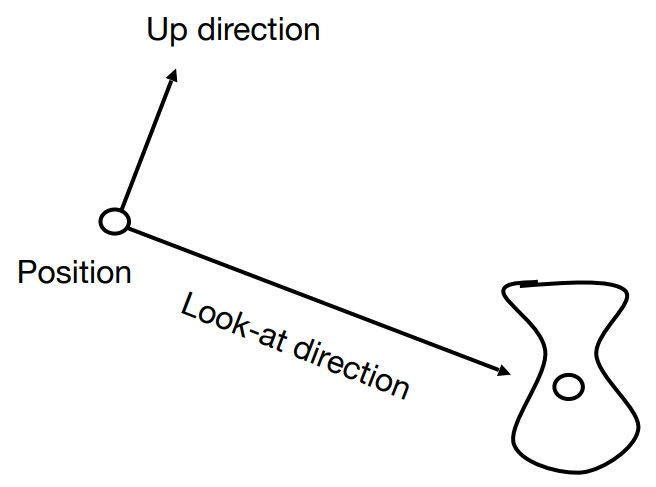
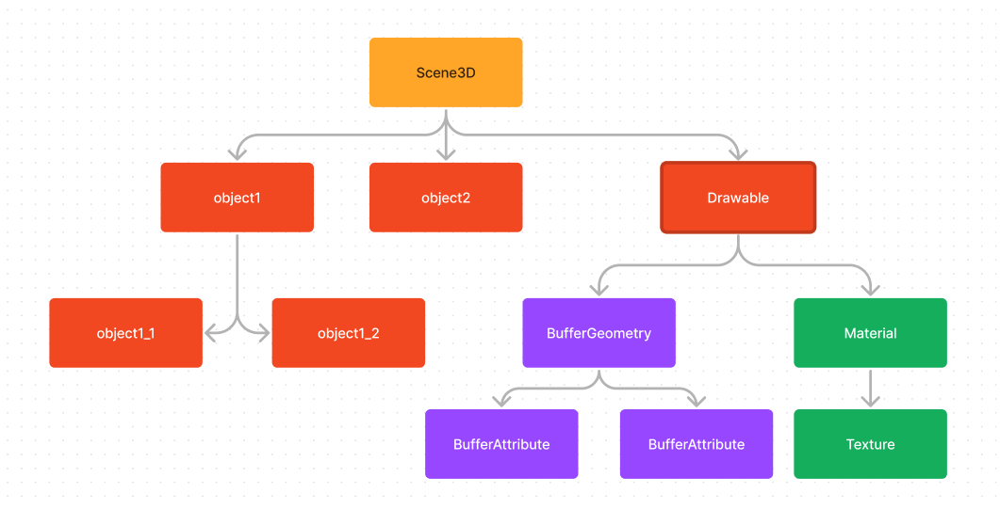
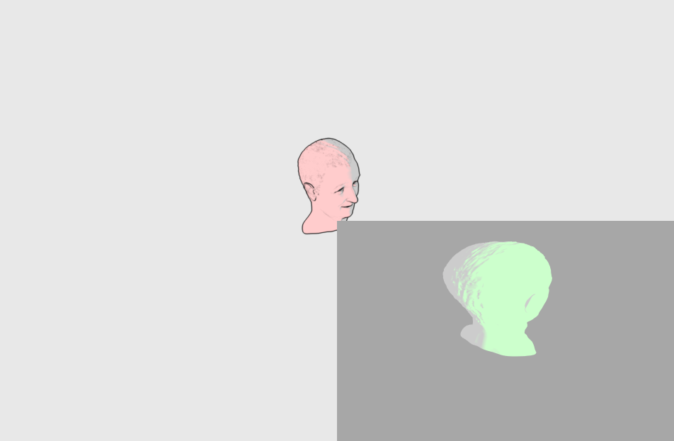
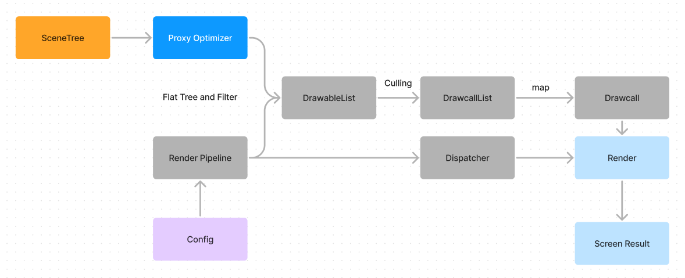

## 阅读入口

这篇文档用于快速建立 Aholo-Viewer 的基础概念

## 什么是 Aholo-Viewer

Aholo-Viewer是支持常规Mesh和3DGS渲染通用渲染器，兼容多种Web图形接口(WebGL, WebGL2)。

## 如何使用

Aholo-Viewer 的基本使用模型是：把物体和灯光放入场景，设置场景和相机，然后触发渲染。

### 物体

物体主要指三维对象，在 Aholo-Viewer 中对应 `Object3D`。`Object3D` 是组成场景的基类，继承结构如下。

`Object3D` 的核心信息包括：

- `parent` 和 `children`：与场景组织相关的父子节点关系。一个 `Object3D` 最多只能有一个 `parent`，可通过 `add` 和 `remove` 接口添加或删除子节点。
- `position`、`rotation` 和 `scale`：分别描述局部位置、旋转和缩放。这些属性可以计算出对象的局部空间变换矩阵，也就是 local matrix。

如果对象存在父节点，仅靠 local matrix 不能完整表示它在世界空间中的变换。子对象需要结合父对象的 world matrix，才能得到自己的 world matrix。world matrix 才真正反映对象在场景中的空间变换。

`Object3D` 本身不能被渲染。它的子类 `Splat`和`Drawable`才是可渲染对象的基类:

- `Splat`是`3DGS`基础可渲染对象，包含完整的`3DGS`数据
- `Drawable` 的核心是 `material` 和 `geometry`，也就是材质和几何。

### `Splat`

`Splat`本身无法被直接构造，包含多种子类用于实际构造，适用于不同的精度场景。

- `CompressedSplat`: 常规精度压缩，用于高精度显示。
- `SuperCompressedSplat`: 超级精度压缩，以损失精度的为代价，降低整体渲染开销，提升性能。
- `SogSplat`: 专为`sog`格式设计的直接渲染组件，不支持高阶球协，但能获得比较好的渲染性能和显示效果。

### 材质

`material` 描述物体外观。常见材质包括受光照影响的 `MeshPhongMaterial`，以及基础材质 `MeshBasicMaterial`。

### 几何

`geometry` 描述面片、线或点。最常见的是由三角形面片组成的几何，对应 `Mesh`。

几何数据实际存放在 attribute 中。除表示位置的 `position` 外，通常还有：

- `uv`：用于纹理采样。
- `normal`：用于光照计算。
- `index`：通过索引 `position` 减少共享顶点带来的数据冗余。

继承链中存在`PopBufferGeometry`，用于支持`PopBuffer`描述的几何，支持Lod，需要配合`PopMesh`使用。
`PopMesh`一般与普通的`Mesh`不存在什么区别

### 灯光

灯光也是一种 `Object3D`。灯光会与材质共同决定物体的外观表现。

常用灯光包括：

- `DirectionalLight`：表示来自无限远处、具有特定方向的光，类似阳光。
- `AmbientLight`：表示无方向环境光，常用于模拟漫反射。

一种常见组合是使用一个 `AmbientLight` 和四个不同方向的 `DirectionalLight` 照亮场景。

阴影也与灯光相关。灯光上的 `shadow` 字段用于控制阴影参数，`Drawable` 上的 `castShadow` 字段表示是否投射阴影。除此之外，`planarShadow` 是一种特殊的平面阴影，不依赖灯光，需要在配置中开启。

### 摄像机

摄像机表示场景中的观察点。常见摄像机分为两类：

- `PerspectiveCamera`：透视相机，遵循近大远小原则，是最常见的相机类型。
- `OrthographicCamera`：正交相机，不产生透视缩放。

### 场景

场景通常也称为场景树，也就是 `SceneTree`。它是最终渲染绘制的数据来源。

### Viewport

viewport为Aholo-Viewer渲染输出的单元，包含边界描述，一个viewer可以拥有多个viewport，viewport具有以下功能:

- 可以是完整的canvas，也可以是canvas的一部分，通过边界描述
- viewport可以拥有完全独立的相机
- 有完整的独立管线配置， 可配置项可以参考[Viewer Config](./config.md)
- 当创建完成Viewer时，默认拥有一个viewport，表示整个canvas

### 内部渲染流程

用户设置的 `Config` 会通过 Render Pipeline 影响绘制列表生成。最终生成的 `DrawcallList` 保存每次调用绘制命令所需的信息。每个 Drawcall 对应一次底层图形 API 指令调用，因此 Drawcall 数量通常与 CPU 开销正相关。

想直观观察这部分流程，可以安装 Chrome 插件 Spector 抓取帧。

### 使用小结

一次基本渲染可以概括为：

1. 构建 `Scene`。
2. 通过 `add` 接口将物体和灯光加入场景树。
3. 设置场景、摄像机和配置。
4. 调用 `render` 接口触发渲染。

## 模型支持

理论上Aholo-Viewer支持任意能够转换到Aholo-Viewer结构的模型的渲染，不过Aholo-Viewer还提供了一些通用格式模型的加载器可以按需取用:

- gltf-loader: 用于加载以gltf/glb格式描述的模型，不过由于Aholo-Viewer目前主要使用Phong进行渲染，基于PBR的gltf材质可能转换不完全
- draco-loader: 用于加载以draco描述的几何。需要进一步转换为Aholo-Viewer可以识别的结构

## 插件系统

Aholo-Viewer还提供一部分插件用于补充一些额外的功能(数据监控，动画等):

- Aholo-Viewer-animation: 为Aholo-Viewer提供额外的动画支持，推荐使用gltf-loader进行构造，目前支持骨骼动画和常规的属性插值变换

## 相关链接

- [WebGL Fundamentals](https://webglfundamentals.org/)
- [WebGL2 Fundamentals](https://webgl2fundamentals.org/)
- [WebGPU Fundamentals](https://webgpufundamentals.org/)
